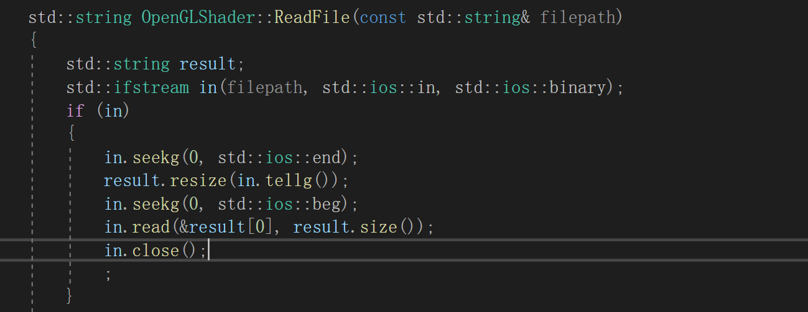
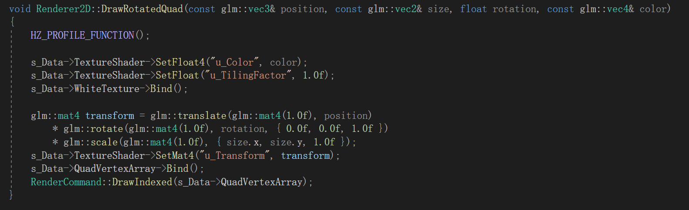

# 任务

- 入口
- 应用层
- 窗口层
  - 输入
  - 事件
- 渲染器
- 渲染API抽象
- 调试支持
- 内存系统
- ECS
- 物理
- 文件IO，VFS
- 构建系统

## 入口

将引擎作为dll给application动态加载使用


通过预编译头，自动决定宏在不同文件中的含义

```
#ifdef HZ_PLATFORM_WINDOWS
	#ifdef HZ_BUILD_DLL
		#define HAZEL_API __declspec(dllexport)
	#else
		#define HAZEL_API __declspec(dllimport)
	#endif
#else
	#error Hazel only supports Windows!
#endif
```


> git reset .
>
> git add .
>
> git status
>
> git commit -m "...."
>
> git push origin main

## Log

接入spdlog

使用宏封装spdlog方法，方便使用

```

//core log macros
#define HZ_CORE_TRACE(...)	::Hazel::Log::GetCoreLogger()->trace(__VA_ARGS__)
#define HZ_CORE_INFO(...)	::Hazel::Log::GetCoreLogger()->info(__VA_ARGS__)
#define HZ_CORE_WARN(...)	::Hazel::Log::GetCoreLogger()->warn(__VA_ARGS__)
#define HZ_CORE_ERROR(...)	::Hazel::Log::GetCoreLogger()->error(__VA_ARGS__)
#define HZ_CORE_FATAL(...)	::Hazel::Log::GetCoreLogger()->fatal(__VA_ARGS__)

//client log macro
#define HZ_TRACE(...)	::Hazel::Log::GetClientLogger()->trace(__VA_ARGS__)
#define HZ_INFO(...)		::Hazel::Log::GetClientLogger()->info(__VA_ARGS__)
#define HZ_WARN(...)		::Hazel::Log::GetClientLogger()->warn(__VA_ARGS__)
#define HZ_ERROR(...)	::Hazel::Log::GetClientLogger()->error(__VA_ARGS__)
#define HZ_FATAL(...)	::Hazel::Log::GetClientLogger()->fatal(__VA_ARGS__)
```

## premake

使用premake5对项目预配置


## 事件系统


<< 重载 返回ToString()


## 预编译头

使用预编译头节省编译时间


## 窗口

使用GLFW创建窗口

创建一个window抽象类，给不同平台创建窗口使用


## 窗口事件


在OnUpdate中拉取事件


设置glfw 回调函数


事件调度器绑定回调函数


## 层/层栈


## 添加GLAD

> GLFW 提供 OpenGL, OpenGL ES 和 Vulkan 的桌面开发环境，是一个跨平台的开源库。利用它可以创建窗口、处理键盘鼠标等事件。windows下它使用win32 api创建窗口，WGL关联OPENGL上下文。Linux 下使用 X11创建窗口，GLX关联OPENGL上下文。MAC下使用cocoa创建窗口，AGL关联OPENGL上下文。
>
> GLAD 的功能比较专一，专门加载OpenGL的函数指针。查看源码有大量看起来重复的代码，但是是很必要的，因为每一个函数都要重复相同的搜寻过程。都是些dirty work,dirty code。

## 添加UI界面

封装ImGUI

设置输入回调事件


## 输入轮询

在Input类写一些轮询输入的接口

在windowsInput写windows输入轮询


定义 按键/鼠标 编码


使用事件系统给按键添加回调

## 添加glm

## imgui吸附界面

## 渲染

### 抽象渲染上下文


为以后可能添加的directX等留空

### 绘制三角形

>  glEnableVertexAttribArray(no)
>
> no是一个数字，比如6，这个数字就表示某个顶点属性，或者表示其编号，因为VAO可以看成一个数组，这个数字也可以看成这个数组的索引，它对应的应该是glsl中的layout (location = 6) 这段代码。
>
> 我们可以认为VAO这个数组中的每个元素都有两个状态，enabled和disabled，默认都是disabled，此时 VertexShader去读取对应的值时，读到的将是一个默认值（而不是数组中的值）
>
> glEnableVertexAttribArray的作用就是将该状态置为enabled，此时着色器读取值才能生效
>
> glVertexAttribPointer 
>
> 我们可以看到这个参数基本上是顶点格式信息，同时第一个参数是一个索引，这个索引和上面的索引应该是同一个意思，表示这个顶点格式信息（顶点属性）要存放在VAO的哪个元素中                       


### shader


顶点着色器和片段着色器


- 将顶点传入顶点着色器
- 根据顶点位置计算颜色

### 抽象渲染API

使用工厂模式，根据不同的RendererAPI创建对应的buffer


### 顶点buffer层


用于对顶点buffer的统一数据理解和分解

### 顶点数组

拥有顶点buffer和索引buffer的引用


方便统一管理


### 添加渲染API

用RendererAPI和工厂方法封装OpenGL DirectX等

用RendererCommand封装RendererAPI的操作

### 添加正交相机


根据相机的位置 计算vp矩阵

在场景开始时获取到vp矩阵


在shader中调用这个vp矩阵


## Timestep

游戏中要统一运行速度


## 创建Shader工厂

将之前的OpenGLShader转移到Shader工厂的子类下

## 添加Texture

加载纹理


gl传送纹理到gpu


通过vs传入纹素然后通过fs上色

## 纹理blend


## 独立出shader文件


使用 fstream读取文件



规定每个shader中的 vertex 和fragment 都是用 #type 分割的

所以字符串处理把对应的shader存到unordered_map中


使用gl编译ma中的shader


使用：


## 添加ShaderLibrary记录拥有的shader


## 相机Controller


```c++
namespace Hazel {

	OrthographicCameraController::OrthographicCameraController(float aspectRatio, bool rotation)
		: m_AspectRatio(aspectRatio), m_Camera(-m_AspectRatio * m_ZoomLevel, m_AspectRatio * m_ZoomLevel, -m_ZoomLevel, m_ZoomLevel), m_Rotation(rotation)
	{
	}

	void OrthographicCameraController::OnUpdate(Timestep ts)
	{
		if (Input::IsKeyPressed(HZ_KEY_A))
			m_CameraPosition.x -= m_CameraTranslationSpeed * ts;
		else if (Input::IsKeyPressed(HZ_KEY_D))
			m_CameraPosition.x += m_CameraTranslationSpeed * ts;
		//...
		m_Camera.SetPosition(m_CameraPosition);

		m_CameraTranslationSpeed = m_ZoomLevel;
	}

	void OrthographicCameraController::OnEvent(Event& e)
	{
		EventDispatcher dispatcher(e);
		dispatcher.Dispatch<MouseScrolledEvent>(HZ_BIND_EVENT_FN(OrthographicCameraController::OnMouseScrolled));
		dispatcher.Dispatch<WindowResizeEvent>(HZ_BIND_EVENT_FN(OrthographicCameraController::OnWindowResized));
	}

	bool OrthographicCameraController::OnMouseScrolled(MouseScrolledEvent& e)
	{
		m_ZoomLevel -= e.GetYOffset() * 0.25f;
		m_ZoomLevel = std::max(m_ZoomLevel, 0.25f);
		m_Camera.SetProjection(-m_AspectRatio * m_ZoomLevel, m_AspectRatio * m_ZoomLevel, -m_ZoomLevel, m_ZoomLevel);
		return false;
	}

}
```

## 2D Renderer


开启深度测试添加几个方形

## 调试工具

### 计算各个操作的耗时

使用chrono计算各个操作的耗时


渲染到imgui上


将上述代码封装在Instrumentor中

## 计算图形的旋转



## 批处理


将需要的信息存到buffer 依次赋值

在一次drawcall中全部处理


添加对材质的批处理


添加对旋转图形的drawcall

添加对drawcall的状态的检测


## 添加可扩展空间


## 封装opengl的帧缓冲

## 编辑器界面

创建了一个新的editor项目，把sandbox的文件做了些修改

### 添加视口


从帧缓冲中获取颜色 输出到视口中

### 处理视口控制


根据对视口是否聚焦和悬停决定是否允许对其操作


## ECS

将相同的entity存到数组中，统一绘制


### entity

entity是component的集合

使用entity在scene的注册表中增删改查


### 添加camera

区分主相机和其他相机


添加场景相机用来计算矩阵变换，支持调整大小

## 添加细节面板

点击entity创建细节信息


# 添加保存系统

对entity序列化 和 反序列化

用于save open


