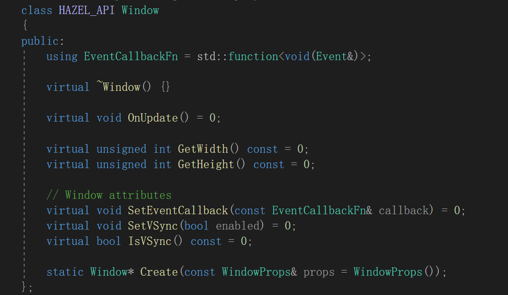

# Hazel Engine


## 任务

- 入口
- 应用层
- 窗口层
  - 输入
  - 事件
- 渲染器
- 渲染API抽象
- 调试支持
- 内存系统
- ECS
- 物理
- 文件IO，VFS
- 构建系统

## 入口

将引擎作为dll给application动态加载使用


通过预编译头，自动决定宏在不同文件中的含义

```
#ifdef HZ_PLATFORM_WINDOWS
	#ifdef HZ_BUILD_DLL
		#define HAZEL_API __declspec(dllexport)
	#else
		#define HAZEL_API __declspec(dllimport)
	#endif
#else
	#error Hazel only supports Windows!
#endif
```


> git reset .
>
> git add .
>
> git status
>
> git commit -m "...."
>
> git push origin main

## Log

接入spdlog

使用宏封装spdlog方法，方便使用

```

//core log macros
#define HZ_CORE_TRACE(...)	::Hazel::Log::GetCoreLogger()->trace(__VA_ARGS__)
#define HZ_CORE_INFO(...)	::Hazel::Log::GetCoreLogger()->info(__VA_ARGS__)
#define HZ_CORE_WARN(...)	::Hazel::Log::GetCoreLogger()->warn(__VA_ARGS__)
#define HZ_CORE_ERROR(...)	::Hazel::Log::GetCoreLogger()->error(__VA_ARGS__)
#define HZ_CORE_FATAL(...)	::Hazel::Log::GetCoreLogger()->fatal(__VA_ARGS__)

//client log macro
#define HZ_TRACE(...)	::Hazel::Log::GetClientLogger()->trace(__VA_ARGS__)
#define HZ_INFO(...)		::Hazel::Log::GetClientLogger()->info(__VA_ARGS__)
#define HZ_WARN(...)		::Hazel::Log::GetClientLogger()->warn(__VA_ARGS__)
#define HZ_ERROR(...)	::Hazel::Log::GetClientLogger()->error(__VA_ARGS__)
#define HZ_FATAL(...)	::Hazel::Log::GetClientLogger()->fatal(__VA_ARGS__)
```

## premake

使用premake5对项目预配置


## Event System


<< 重载 返回ToString()


## 预编译头

使用预编译头节省编译时间


## 窗口

使用GLFW创建窗口

创建一个window抽象类，给不同平台创建窗口使用



## 窗口事件


在OnUpdate中拉取事件


设置glfw 回调函数


事件调度器绑定回调函数


## 层/层栈


